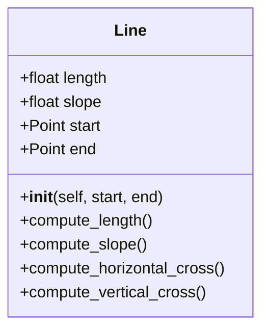
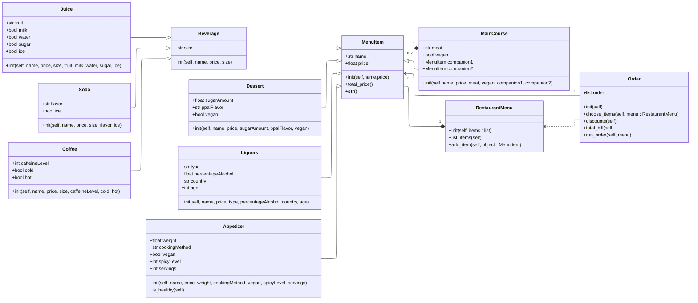

# Reto 3
<p>
  1. Ejercicio de clase solicitado:
</p>


<p>
  Código de solución:
</p>

```python
import math

class Point:
    def __init__ (self, x : float,y: float):
        self.x= x
        self.y= y
    def __str__(self):
        return f"Point({self.x}, {self.y})"
    
class Line:
    def __init__(self, start: Point, end: Point):
        self.start = start
        self.end = end
        self.length = 0
        self.slope = 0
        
    def calculate_m(self):
        if self.end.x == self.start.x:
            return None
        return ((self.end.y - self.start.y)/(self.end.x - self.start.x))
            
    def compute_length(self):
        self.length = math.hypot((self.end.x - self.start.x),(self.end.y - self.start.y))
        return self.length
    
    def compute_slope(self):
        m = self.calculate_m()
        if m is None:
            self.slope = 90
        else:
            self.slope = math.degrees(math.atan(m))
        return self.slope
    
    def compute_horizontal_cross(self):
        if self.end.x == self.start.x:
            return Point (self.start.x, 0)
            
        if self.start.y == 0 and self.end.y == 0:
            print ("El cruce horizontal es infinito pues la línea se encuentra sobre el eje x.")
            return None
            
        if (self.start.y == self.end.y):
            print ("La línea nunca cruza el eje x")
            return None
            
        m = self.calculate_m()
        return  Point ((self.start.x - (self.start.y / m)), 0)

    def compute_vertical_cross(self):   
        if self.start.y == self.end.y:
            return Point(0, self.start.y)
            
        if self.start.x == 0 and self.end.x == 0:
            print ("El cruce vertical es infinito, pues la línea se encuentra sobre el eje y.")
            return None
            
        if (self.start.x == self.end.x):
            print ("La línea nunca cruza el eje y")
            return None
            
        m = self.calculate_m()
        if m is None:
            return None
        return Point(0, (self.start.y - (m * self.start.x)))
```
<p>
  2. Redefinición de la clase rectangle.
</p>

**Me gustaría realizar una aclaración:*** Tengo perfecto conocimiento de que en clase el docente indicó 
que debía realizarse usando ```*args``` y ```**kwargs```. No obstante, en alguno de los links de mermaid 
se hablaba sobre decoradores, incluyendo ```@classmethod```. Por ende, la primera solución será tal cual 
la indicación de clase, mientras que la segunda es usando los decoradores.

```python
import math

class Point:
    def __init__(self, x : float,y: float):
        self.x = x
        self.y = y
    def __str__(self):
        return f"Point({self.x}, {self.y})"


class Line:
    def __init__(self, start: Point, end: Point):
        self.start = start
        self.end = end
        self.length = 0
        self.slope = 0
        
    def calculate_m(self):
        if self.end.x == self.start.x:
            return None
        return ((self.end.y - self.start.y)/(self.end.x - self.start.x))
            
    def compute_length(self):
        self.length = math.hypot((self.end.x - self.start.x),(self.end.y - self.start.y))
        return self.length
    
    def compute_slope(self):
        m = self.calculate_m()
        if m is None:
            self.slope = 90
        else:
            self.slope = math.degrees(math.atan(m))
        return self.slope
    
    def compute_horizontal_cross(self):
        if self.end.x == self.start.x:
            return Point (self.start.x, 0)
            
        if self.start.y == 0 and self.end.y == 0:
            print ("El cruce horizontal es infinito pues la línea se encuentra sobre el eje x.")
            return None
            
        if (self.start.y == self.end.y):
            print ("La línea nunca cruza el eje x")
            return None
            
        m = self.calculate_m()
        return  Point ((self.start.x - (self.start.y / m)), 0)

    def compute_vertical_cross(self):   
        if self.start.y == self.end.y:
            return Point(0, self.start.y)
            
        if self.start.x == 0 and self.end.x == 0:
            print ("El cruce vertical es infinito, pues la línea se encuentra sobre el eje y.")
            return None
            
        if (self.start.x == self.end.x):
            print ("La línea nunca cruza el eje y")
            return None
            
        m = self.calculate_m()
        if m is None:
            return None
        return Point(0, (self.start.y - (m * self.start.x)))


class Rectangle:
    def __init__ (self, *args, **kwargs):
        if "bottom_left" in kwargs:
            bottom_left = kwargs["bottom_left"]
            self.width = kwargs ["width"]
            self.height = kwargs["height"]
            self.__validate_data()
            
            center_x = bottom_left.x + self.width / 2
            center_y = bottom_left.y + self.height / 2
            self.center = Point(center_x, center_y)
            
        elif "center" in kwargs:
            self.center = kwargs["center"]
            self.width = kwargs ["width"]
            self.height = kwargs["height"]
            self.__validate_data()
            
        elif "bottom_left" in kwargs and "top_right" in kwargs:
            bottom_left = kwargs["bottom_left"]
            top_right = kwargs["top_right"]

            self.width = (abs(top_right.x-bottom_left.x))
            self.height = (abs(top_right.y-bottom_left.y))
            self.__validate_data()

            center_x = (bottom_left.x + top_right.x)/2
            center_y = (bottom_left.y + top_right.y)/2
            self.center = Point(center_x, center_y)

        elif "lines" in kwargs:
            lines = kwargs["lines"]

            if len(lines) != 4:
                raise ValueError("Deben ser 4 líneas, pues un rectángulo se compone de exactamente dicha cantidad.")
            
            for l in lines:
                if not isinstance(l,Line):
                    raise TypeError("Los elementos deben ser de tipo Line, no de otro tipo.")
            
            x_points = []
            y_points = []
            
            for l in lines:
                x_points.extend ([l.start.x, l.end.x])
                y_points.extend ([l.start.y, l.end.y])
            
            self.width = max(x_points) - min(x_points)
            self.height = max(y_points) - min(y_points)
            
            self.__validate_data()
            center_x = (max(x_points) + min(x_points)) / 2
            center_y = (max(y_points) + min(y_points)) / 2
            self.center = Point (center_x, center_y)
            self.lines = lines

        else:
            raise ValueError ("Formato no válido, no coincide con ninguno de los tres métodos.")
    
    def __validate_data(self):
        if self.width < 0 or self.height < 0:
            raise ValueError("El ancho o el alto no pueden ser negativos.")
        elif self.width == 0 or self.height == 0:
            raise ValueError("El ancho o el alto no pueden ser iguales a 0.")
    
    def compute_area(self):
        return self.width*self.height
    
    def compute_perimeter(self):
        return ((self.width*2)+(self.height*2))

    def compute_interference_point(self, point: Point):
        limit_1_x = (self.width / 2) + self.center.x
        limit_2_x = self.center.x - (self.width/2)
        limit_1_y = (self.height / 2) + self.center.y
        limit_2_y = self.center.y - (self.height / 2)

        return (point.x <= limit_1_x and point.x >=limit_2_x and point.y <= limit_1_y and point.y >= limit_2_y )
```

  Ahora bien, la solución con ```@classmethod```.

```python
import math

class Point:
    def __init__(self, x: float, y: float):
        self.x = x
        self.y = y
    def __str__(self):
        return f"Point({self.x}, {self.y})"


class Line:
    def __init__(self, start: Point, end: Point):
        self.start = start
        self.end = end
        self.length = 0
        self.slope = 0
        
    def calculate_m(self):
        if self.end.x == self.start.x:
            return None
        return ((self.end.y - self.start.y)/(self.end.x - self.start.x))
            
    def compute_length(self):
        self.length = math.hypot((self.end.x - self.start.x),(self.end.y - self.start.y))
        return self.length
    
    def compute_slope(self):
        m = self.calculate_m()
        if m is None:
            self.slope = 90
        else:
            self.slope = math.degrees(math.atan(m))
        return self.slope
    
    def compute_horizontal_cross(self):
        if self.end.x == self.start.x:
            return Point(self.start.x, 0)
            
        if self.start.y == 0 and self.end.y == 0:
            print("El cruce horizontal es infinito pues la línea se encuentra sobre el eje x.")
            return None
            
        if self.start.y == self.end.y:
            print("La línea nunca cruza el eje x")
            return None
            
        m = self.calculate_m()
        
        if m is None:
            return None
            
        return Point((self.start.x - (self.start.y / m)), 0)

    def compute_vertical_cross(self):   
        if self.start.y == self.end.y:
            return Point(0, self.start.y)
            
        if self.start.x == 0 and self.end.x == 0:
            print("El cruce vertical es infinito, pues la línea se encuentra sobre el eje y.")
            return None
            
        if self.start.x == self.end.x:
            print("La línea nunca cruza el eje y")
            return None
            
        m = self.calculate_m()
        
        if m is None:
            return None
            
        return Point(0, (self.start.y - (m * self.start.x)))


class Rectangle:
    def __init__(self, width: float, height: float, center: Point):
        if width <= 0 or height <= 0:
            raise ValueError("La altura o el ancho de un rectángulo no pueden ser iguales a 0.")
        self.width = width
        self.height = height
        self.center = center

    @classmethod
    def method_1(cls, bottom_left: Point, width: float, height: float):
        center = Point(bottom_left.x + width/2, bottom_left.y + height/2)
        return cls(width, height, center)

    @classmethod
    def method_2(cls, width: float, height: float, center: Point):
        return cls(width, height, center)

    @classmethod
    def method_3(cls, bottom_left: Point, top_right: Point):
        width = abs(top_right.x - bottom_left.x)
        height = abs(top_right.y - bottom_left.y)
        center = Point((bottom_left.x + top_right.x)/2, (bottom_left.y + top_right.y)/2)
        return cls(width, height, center)

    @classmethod
    def method_4(cls, l1: Line, l2: Line, l3: Line, l4: Line):
        x_points = [l1.start.x, l1.end.x, l2.start.x, l2.end.x, l3.start.x, l3.end.x, l4.start.x, l4.end.x]
        y_points = [l1.start.y, l1.end.y, l2.start.y, l2.end.y, l3.start.y, l3.end.y, l4.start.y, l4.end.y]
        width = max(x_points) - min(x_points)
        height = max(y_points) - min(y_points)
        center = Point((max(x_points) + min(x_points))/2, (max(y_points) + min(y_points))/2)
        return cls(width, height, center)

    def compute_area(self):
        return self.width * self.height

    def compute_perimeter(self):
        return 2*(self.width + self.height)

    def compute_interference_point(self, point: Point):
        return (point.x <= self.center.x + self.width/2 and point.x >= self.center.x - self.width/2 and point.y <= self.center.y + self.height/2 and point.y >= self.center.y - self.height/2)


class Square(Rectangle):
    def __init__(self, side: float, center: Point):
        super().__init__(side, side, center)
```

# Ejercicio restaurante:
<p>
  Diagrama de clases:
</p>



<p>
  Código de solución:
</p>

```python
  class MenuItem:
      def __init__(self, name: str, price: float):
          self.name = name
          self.price = price
  
      def __str__(self):
          return f"Item: {self.name}, Precio: {self.price}"
  
      def total_price(self, amount: int):
          return amount * self.price
  
  
  class Beverage(MenuItem):
      def __init__(self, name: str, price: float, size: str):
          super().__init__(name, price)
          self.size = size
  
  
  class Juice(Beverage):
      def __init__(
          self, 
          name: str, 
          price: float, 
          size: str, 
          fruit: str, 
          milk: bool, 
          water: bool, 
          sugar: bool, 
          ice: bool
      ):
                       
          super().__init__(name, price, size)
          self.fruit = fruit
          self.milk = milk
          self.water = water
          self.sugar = sugar
          self.ice = ice
          
      def __str__(self): 
          return (
              f"{self.name}\n"
              f"Tamaño: {self.size}\n"
              f"Fruta(s): {self.fruit}\n"
              f"Leche: {self.milk}\n"
              f"Agua: {self.water}\n"
              f"Azúcar: {self.sugar} gr\n"
              f"Hielo: {self.ice}\n"
              f"Precio: ${self.price}"
          )
  
  
  class Soda(Beverage):
      def __init__(self, name: str, price: float, size: str, flavor: str, ice: bool):
          super().__init__(name, price, size)
          self.flavor = flavor
          self.ice = ice
          
      def __str__(self):
          return (
              f"{self.name}\n"
              f"Tamaño: {self.size}\n"
              f"Sabor: {self.flavor}\n"
              f"Hielo: {self.ice}\n"
              f"Precio: ${self.price}"
          )
  
  class Coffee(Beverage):
      def __init__(
          self, 
          name: str, 
          price: float, 
          size: str, 
          caffeine_level: int, 
          cold: bool, 
          hot: bool
      ):
          super().__init__(name, price, size)
          self.caffeine_level = caffeine_level
          self.cold = cold
          self.hot = hot
          
      def __str__(self):
          return (
              f"{self.name}\n"
              f"Tamaño: ({self.size})\n"
              f"Nivel de cafeína: {self.caffeine_level}\n"
              f"Frío: {self.cold}\n"
              f"Caliente: {self.hot}"
          )
  
  
  class MainCourse(MenuItem):
      def __init__(
          self, 
          name: str, 
          price: float, 
          meat: str, 
          vegan: bool, 
          companion1: MenuItem | None = None, 
          companion2: MenuItem | None = None
      ):
          super().__init__(name, price)
          self.meat = meat
          self.vegan = vegan
          self.companion1 = companion1
          self.companion2 = companion2
          
      def __str__(self):
          companions = []
          if self.companion1:
              companions.append(self.companion1.name)
          if self.companion2:
              companions.append(self.companion2.name)
  
          companions_str = ", ".join(companions) if companions else "Ninguno"
          return (
              f"{self.name}\n"
              f"Vegano: {self.vegan}\n"
              f"Carne: {self.meat}\n"
              f"Acompañamientos: {companions_str}\n"
              f"Precio: ${self.price}"
          )
      
  class Dessert(MenuItem):
      def __init__(
          self, 
          name: str, 
          price: float, 
          sugar_amount: float, 
          ppal_flavor: str, 
          vegan: bool = False
      ):
          super().__init__(name, price)
          self.sugar_amount = sugar_amount
          self.ppal_flavor = ppal_flavor
          self.vegan = vegan
          
      def __str__(self):
          return (
              f"{self.name}\n"
              f"Vegano: {self.vegan}\n"
              f"Sabor principal: {self.ppal_flavor}\n"
              f"Cantidad azucar: {self.sugar_amount} gr\n"
              f"Precio: ${self.price}"
          )
  
  class Liquors(MenuItem):
      def __init__(
          self, 
          name: str,
          price: float,
          liquor_type: str,
          percentage_alcohol: float,
          country: str,
          age: int
      ):
          super().__init__(name, price)
          self.liquor_type = liquor_type
          self.percentage_alcohol = percentage_alcohol
          self.country = country
          self.age = age
          
      def __str__(self):
          return (
              f"{self.name}\n"
              f"Tipo de licor: {self.liquor_type}\n"
              f"País: {self.country}\n"
              f"Edad: {self.age}\n"
              f"Porcentaje alcohol: {self.percentage_alcohol}\n"
              f"Precio: ${self.price}"
          )
  
  
  class Appetizer(MenuItem):
      def __init__(
          self, 
          name: str, 
          price: float, 
          weight: float, 
          cooking_method: str, 
          vegan: bool, 
          spicy_level: int, 
          servings: int
      ):
          super().__init__(name, price)
          self.weight = weight
          self.cooking_method = cooking_method
          self.vegan = vegan
          self.spicy_level = spicy_level
          self.servings = servings
          
      def is_healthy(self):
          return self.cooking_method.lower() != "fried" and self.vegan
          
      def __str__(self):
          return (
              f"{self.name}\n"
              f"Porciones: {self.servings}\n"
              f"Vegano: {self.vegan}\n"
              f"Método cocción: {self.cooking_method}\n"
              f"Nivel picante: {self.spicy_level}\n"
              f"Peso: {self.weight} gr\n"
              f"Precio: ${self.price}"
          )
  
  
  class RestaurantMenu:
      def __init__(self, items: list[MenuItem]):
          self.items = items
      
      def list_items(self):
          for i, item in enumerate(self.items, start=1):
              print(f"{i}. {item}") 
  
      def add_item(self, item: MenuItem):
          self.items.append(item)
  
  
  class Order:
      def __init__(self):
          self.order = []
          
      def choose_items(self, menu: RestaurantMenu):
          print(
              "\nBienvenido a nuestro restaurante. Primero, lea el menú, "
              "luego, ingrese los índices de los objetos que desea comprar."
               )
          
          menu.list_items()
          
          final_items = input(
              "Índices de los productos que desea comprar, "
              "separados por una coma (,): "
          )
          
          i_items = set(final_items.split(","))  # Acá uso set porque elimina duplicados, aunque sé que no los hemos visto en clase
          for indice_str in i_items:
              indice_int = int(indice_str.strip()) - 1 
              if 0 <= indice_int < len(menu.items):
                  item = menu.items[indice_int]
                  cantidad = int(input(f"Cuántas unidades de {item.name}? "))
                  self.order.append((item, cantidad))
              else:
                  print(f"Índice {indice_int + 1} no válido, se ignora.")
      
      def discounts(self):
          has_beverage = False
          has_maincourse = False
          has_dessert = False
          has_liquors = False
          has_appetizer = False
          beverage_count = 0
          liquors_count = 0
          dessert_count = 0
          maincourse_count = 0
          
          for item, cantidad in self.order:
              if isinstance(item, Beverage):
                  has_beverage = True
                  beverage_count += cantidad
              elif isinstance(item, MainCourse):
                  has_maincourse = True
              elif isinstance(item, Dessert):
                  has_dessert = True
                  dessert_count += cantidad
              elif isinstance(item, Liquors):
                  has_liquors = True
                  liquors_count += cantidad
              elif isinstance(item, Appetizer):
                  has_appetizer = True
  
          total = self.total_bill()
          
          #Zona de descuentos por combos, para que sea más fácil leer:
          basic_combo = has_maincourse and has_beverage and has_dessert
          solo_combo = has_appetizer and has_maincourse and has_beverage and has_dessert
          medium_combo = (has_appetizer and has_maincourse and has_liquors) or (has_maincourse and has_dessert and has_liquors)
          duo_combo = (maincourse_count == 2 and beverage_count == 2) or (maincourse_count == 2 and liquors_count == 2)
          full_combo = has_appetizer and has_maincourse and has_beverage and has_dessert and has_liquors
          extra_items_combo = (dessert_count == 3) or (liquors_count == 3)
  
          if full_combo:
              total = total * 0.83 
          elif medium_combo:            
              total = total * 0.85
          elif solo_combo or duo_combo or extra_items_combo:
              total = total * 0.90
          elif basic_combo:
              total = total * 0.95
  
          return total
      
      def total_bill(self):
          return float(sum(item.price * cantidad for item, cantidad in self.order))
  
      def run_order(self, menu: RestaurantMenu):
          self.choose_items(menu)
          print("\nResumen del pedido:")
          print("-------------------")
          print(f"Total sin descuento: ${self.total_bill()}")
          print(f"Total con descuentos: ${self.discounts()}")
  
  menu = RestaurantMenu([Juice("Explosión roja", 4, "Medium", "Mora, Fresa, Cereza y Sandía", False, True, True, True), Juice("Jugo de lulo", 5, "Medium", "Lulo", False, True, True, True), Soda("Naturaleza Fresca", 10, "Big", "Menta & Hierbabuena", True), Coffee("Americano", 3, "Small", 8, False, True), MainCourse("Filet Mignon", 25, "Res", False, MenuItem("Papas fritas", 0), MenuItem("Arroz blanco", 0)), Dessert("Tiramisu", 12, 15, "Café y crema", False), Liquors("Vino tinto", 15, "Vino", 11, "Español", 12), Liquors("Cerveza artesanal", 5, "Cerveza", 5, "Alemana", 0),Appetizer("Deditos de mozzarella", 10, 250, "Fried", False, 0, 3), MainCourse("Pollo en salsa de champiñon", 20, "Pollo", False, MenuItem("Papas en cascos", 0))])
  orden1 = Order()
  orden1.run_order(menu)
```

