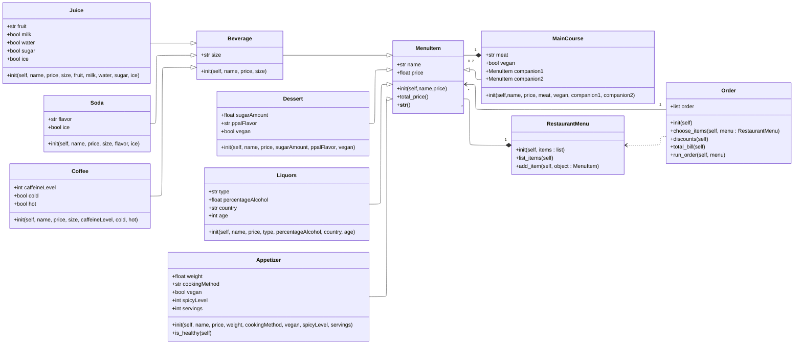

```mermaid
---
config:
  layout: elk
---
classDiagram
    direction RL
    class MenuItem{
        +str name
        +float price
        +init(self,name,price)
        +total_price()
        +__str__()
    }
    class Beverage{
        +str size
        +init(self, name, price, size)
    }
    class Juice{
        +str fruit
        +bool milk
        +bool water
        +bool sugar
        +bool ice
        +init(self, name, price, size, fruit, milk, water, sugar, ice)
    }
    class Soda{
        +str flavor
        +bool ice
        +init(self, name, price, size, flavor, ice)
    }
    class Coffee{
        +int caffeineLevel
        +bool cold
        +bool hot
        +init(self, name, price, size, caffeineLevel, cold, hot)
    }
    class MainCourse{
        +str meat
        +bool vegan
        +MenuItem companion1
        +MenuItem companion2
        +init(self,name, price, meat, vegan, companion1, companion2)
    }
    class Dessert{
        +float sugarAmount
        +str ppalFlavor
        +bool vegan
        +init(self, name, price, sugarAmount, ppalFlavor, vegan)
                      
    }                                          
    class Liquors{
        +str type
        +float percentageAlcohol
        +str country
        +int age
        +init(self, name, price, type, percentageAlcohol, country, age)
    }
    class Appetizer{
        +float weight
        +str cookingMethod
        +bool vegan
        +int spicyLevel
        +int servings
        +init (self, name, price, weight, cookingMethod, vegan, spicyLevel, servings)                                                       
        +is_healthy(self)
    }
    class RestaurantMenu{
        +init(self, items : list)
        +list_items(self)
        +add_item(self, object : MenuItem)
    }
    class Order{
        +list order
        +init(self)
        +choose_items(self, menu : RestaurantMenu)
        +discounts(self)
        +total_bill(self)
        +run_order(self, menu)
    }
    MenuItem <|-- Beverage
    MenuItem <|-- MainCourse
    MenuItem <|-- Dessert
    MenuItem <|-- Liquors
    MenuItem <|-- Appetizer
    Beverage <|-- Juice
    Beverage <|-- Soda
    Beverage <|-- Coffee
    Order "1" --> "*" MenuItem
    Order ..> RestaurantMenu
    RestaurantMenu "1" *-- "*" MenuItem
    MainCourse "1" *-- "0..2" MenuItem
```
